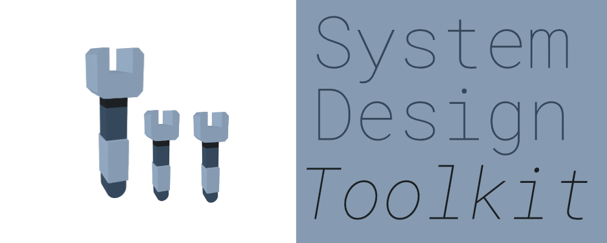
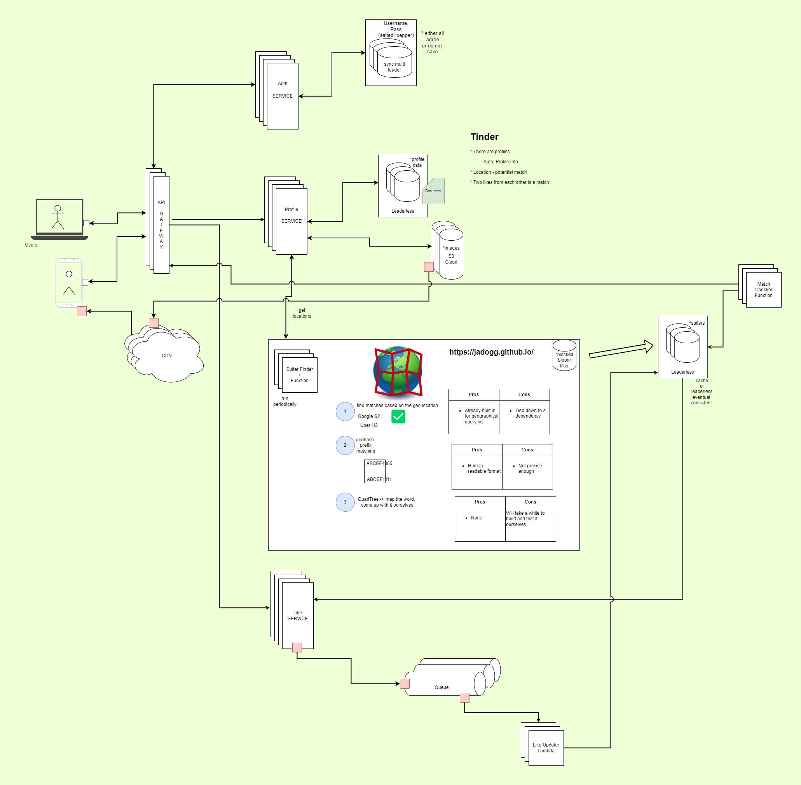
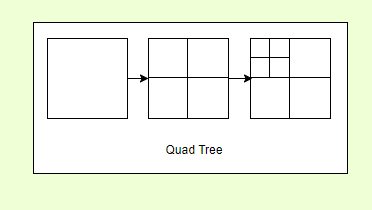
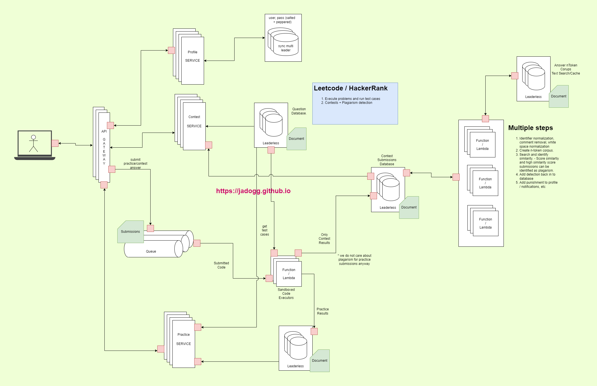
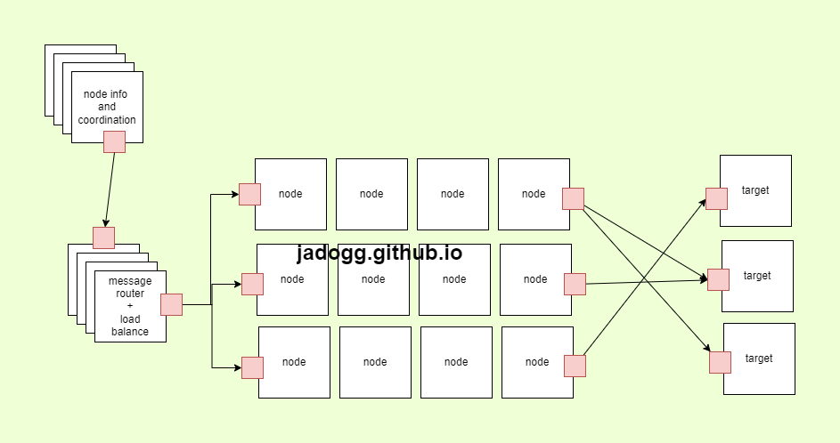
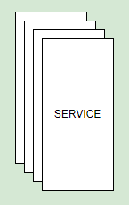
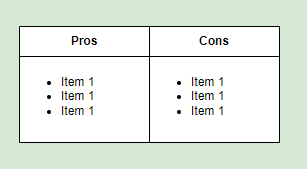

#  Introduction
I got an idea to come up with set of reusable (technology oblivious) building blocks for system design. Main point is you can either use it diagrams.net (or desktop version), whiteboard or any other tool you like. I use it myself and there's no reason for people other than me to use it. I'm designing this backwards from system design diagrams, so I will come up with multiple system designs and extract common components. Any form of constructive criticism is appreciated as usual.

---

📝<small>
🤔 Disagreeing for the sake of it is bad, cargo-culting is bad, somewhere middle is probably zen. - Me.
</small>

---

#  Usage Samples
For usage examples I am planning on trying few system designs of well-known software that anyone would be aware of. I'll be diving as deep as I think is necessary to explain my design here. By making myself come up with these designs I achieve two things. First of all, I get to see what kind of common components are present in these system designs. I also get to publicly practice system design and expose myself to criticism.

---

📝<small>
Hopefully constructive criticism.
</small>

---

##  Tinder System Design

---

📝<small>
I'm up for suggestions. If you got an idea let me know.
in progress
</small>

---

###  How to find people close to you?

Main crux of this design is to find a suitable methodology to find people close to you.
*  We can use Google S3 or Uber H3 - Both are ready-made libraries for this task.
*  We can use geo-hash prefix matching. This is a human-readable format, and you can easily look at two hashes and if they are closer based on the prefix.
*  Creating our own library - quad tree.

####  Quad Tree

This is an important data structure that we can use if we want to come up with this ourselves. Think of this as a structure that allows you to break down a square to four small squares, and you can keep going until it is very small. Internally it is a tree with 4 children.

####  Querying nearby people

In above design we assumed that we use can find nearby users by simply looking at the profile database. However, we did not dive deep into what we need to ensure that we properly distribute profile data so we do not brown out a single node.

####  Geo-sharding

Geo sharding is a concept where we map roughly similar user count regions of the world in to different shards of the database. This is a load balancing mechanism and a way to avoid querying a lot of nodes and wasting time. As explained in Tinder blog posts they came up with shards by experimenting and finding out which number of shards and how it was distributed resulted in good p50, p90 and p99 latency metrics. Example - London can be placed in one geo-shard while most of the Australian desert can also be placed in a single geo-shard. So the actual number of users would impact this rather than surface area on Earth.

---

📝<small>
Geo-sharding is a form of load balancing.
</small>

---

####  Matching and likes

For this I'm thinking we can use a queue and set of serverless functions/lambdas to process incoming likes and write that to a database/cache. And we can use another set of lambdas to turn matches to notifications.

---

📝<small>
System that can spin up on-demand functions and distributed queues are (sub)systems of this system.
</small>

---

###  Rest of the system

####  Authentication and security

For a secure system we need to consider `AAA` (Authentication , Authorization, and Accounting). However, there is no need to do implement a `RBAC` (Role-based access control) for end-users of the system. They will all be able to log-in to their own account and use the application. `RBAC` and full `AAA` is however important for internal teams and any admin applications used internally.
So from system design perspective something like eventual consistency does not make sense for passwords. Passwords themselves we cannot store in a database like you would with any other data.
*  OWASP recommend `Argon2id` these days (`scrypt` and `PBKDF2-HMAC-SHA512` with `120k` iterations is also sufficient).
*  We can also use `peppering` for further security.
*  Another alternative is to sign in using email and never store any passwords.
*  It is also better to avoid coming up with own cryptographical algorithms.
*  It is perfectly fine to write it yourself for everything else. Having too many dependencies open yourself up to a lot of vulnerabilities.
   Getting back to why not eventual consistency, it is because if you change the password - It needs either successfully change everywhere or not change at all. This disallows a bad actor to luck into the system.

---

📝<small>
We can design authentication as a system as well.
</small>

---

####  Storing images

For a service such as Tinder images are essential. However, images are not required to find nearby users. It is however essential for users to see other users' images. Therefore, we can use on-disk storage for images and have a reference to it in our profile database. So, when a user browses a profile we can get request these images on demand. It makes sense to use a distributed file system.

---

📝<small>
`DFS` (Distributed file system) is a (sub)system that we use in this system.
</small>

---

#####  Caches and power law distribution

Caches or in this case specifically a `CDN` (Content delivery network) which is also another system on its own can help us scale with the load to access these user images. Let's think of celebrity situation, suddenly a recently divorced famous actor/actress creates a Tinder account. Now everyone wants to look at their images and swipe (whatever side for like). This is a good use-case for a `CDN` as these celebrity images are now cached.
Since the number of requests for an account is distributed in a power law distribution due to pareto principle. We can assume that the CDN can use a `LRU` (Least recently used) cache eviction mechanism. This way most recently used image will be kept hot in the cache.

---

📝<small>
Likes, Money and Followers this all work in a power law distribution, those who have more will always get more.
</small>

---

#####  Image formats

Thumbnails for images is essential, and we can use a lossy data format such as JPG for thumbnails. Another good alternative is WebP. Also, PNGs can be used if we need any crisp images, but we can just use JPG for that as well.

---

📝<small>
Google's WebP format is supported across most browsers and platforms these days.
</small>

---

###  Bibliography for Tinder system design

Bibliography for Tinder Design
<small>
AAA (computer security). (2022). Wikipedia. Available from https://en.wikipedia.org/w/index.php?title=AAA_(computer_security)&oldid=1068643459 [Accessed 1 July 2022].

Designing Tinder - High Scalability -. (no date). Available from http://highscalability.com/blog/2022/1/17/designing-tinder.html [Accessed 1 July 2022].

Geometry on the Sphere: Google\x27s S2 Library. (no date). Available from https://docs.google.com/presentation/d/1Hl4KapfAENAOf4gv-pSngKwvS_jwNVHRPZTTDzXXn6Q [Accessed 1 July 2022].

GKQuadtree | Apple Developer Documentation. (no date). Available from https://developer.apple.com/documentation/gameplaykit/gkquadtree [Accessed 1 July 2022].

Li, X. (2019). Geosharded Recommendations Part 2: Architecture. Tinder Tech Blog. Available from https://medium.com/tinder/geosharded-recommendations-part-2-architecture-3396a8a7efb [Accessed 1 July 2022].

Pareto principle. (2022). Wikipedia. Available from https://en.wikipedia.org/w/index.php?title=Pareto_principle&oldid=1095743858 [Accessed 1 July 2022].

Password Storage - OWASP Cheat Sheet Series. (no date). Available from https://cheatsheetseries.owasp.org/cheatsheets/Password_Storage_Cheat_Sheet.html#pbkdf2 [Accessed 1 July 2022].

Passwordless authentication. (2022). Wikipedia. Available from https://en.wikipedia.org/w/index.php?title=Passwordless_authentication&oldid=1082243741 [Accessed 1 July 2022].

Power law. (2022). Wikipedia. Available from https://en.wikipedia.org/w/index.php?title=Power_law&oldid=1091370904 [Accessed 1 July 2022].

Ren, F. (2019). Geosharded Recommendations Part 1: Sharding Approach. Tinder Tech Blog. Available from https://medium.com/tinder/geosharded-recommendations-part-1-sharding-approach-d5d54e0ec77a [Accessed 1 July 2022].

Role-based access control. (2022). Wikipedia. Available from https://en.wikipedia.org/w/index.php?title=Role-based_access_control&oldid=1094481919 [Accessed 1 July 2022].

S2 Geometry. (no date). S2Geometry. Available from http://s2geometry.io/ [Accessed 1 July 2022].

Thomson, D. (2019). Geosharded Recommendations Part 3: Consistency. Tinder Tech Blog. Available from https://medium.com/tinder/geosharded-recommendations-part-3-consistency-2d2cb2f0594b [Accessed 1 July 2022].

Tran, J. (2019). Which Image Format for Making Smaller File Size? GretaThemes. Available from https://gretathemes.com/image-format-for-smaller-file-size/ [Accessed 1 July 2022].

UV mapping. (2022). Wikipedia. Available from https://en.wikipedia.org/w/index.php?title=UV_mapping&oldid=1094514074 [Accessed 1 July 2022].

WebP Compression Study. (no date). Google Developers. Available from https://developers.google.com/speed/webp/docs/webp_study [Accessed 1 July 2022].

What is a Quadtree & how is it used in location-based services? (no date). Available from https://www.educative.io/answers/what-is-a-quadtree-how-is-it-used-in-location-based-services [Accessed 1 July 2022].

Whited, S. (no date). Best practices for password hashing and storage. Internet Engineering Task Force. Available from https://datatracker.ietf.org/doc/draft-ietf-kitten-password-storage-04 [Accessed 1 July 2022].

</small>

##  Leetcode / Hacker rank system design

---

📝<small>
I'm up for suggestions for this as well.
in progress
</small>

---

###  Code execution
Sandboxed code execution is one of the main features of an online judge platforms.
*  Need to be isolated from the rest of the system - this is because some executed code can be malicious.
    *  Would be a good idea to disable everything except stdin/stdout as input output mechanisms.
    *  No access to internet is a must as that opens us up to more risks.
*  Need to be flexible enough to run different supported compilers and interpreters.
*  In case of endless loops or the solution taking too much time we need to timeout.
*  Need to be able to handle scale of increased load to judge system.
    *  Either by queuing input or rejecting.
    *  Can also dynamically scale with more nodes if needed.

####  Solution A: Docker containers on lambdas (serverless)

*  👍 Can scale up with more functions, of course that would also cost more.
*  👍 Less hassle to set up if you wish to go this route.
*  👍 Built in timeout logic.
*  👍 Paid only for usage when lambdas are run.

---

📝<small>
It is almost as if lambdas were built for this. 😏
</small>

---

####  Solution B: Servers that take work from a queue spin up docker containers

*  👍 Fixed cost if sufficient servers are present.
*  👎 Same cost even if there are no usage.
*  👎 Cannot scale up as needed and more servers need to be added manually.
*  👎 Need to come up with services that can take work from a queue and spin up docker containers
*  👎 Server CPU/RAM monitoring is required to see that a container does not use too many resources.
*  👎 Need to implement timing out logic.

###  Plagiarism detection
It is possible to create an online judge system without a plagiarism detection method. However, it is needed if we want to run contests. Contestants will cheat and there should be a way to detect it.

####  Different forms of cheating
*  A: Just copying and pasting same answer
*  B: Copying and pasting same answer with different comments, whitespace changes.
*  C: Variable name, function name changes
*  D: Combination of both B and C.
*  E: Partial similarities + D.

---

📝<small>
If you rewrite it as a complete different algorithm, it is not possible detect. However, this is sufficient for what we need to do. Even coming up with a way to detect A or B type of cheating would be useful.
</small>

---

####  Cheat detection process
I would implement cheat detection as a multistep process. We can have coordinated lambda executions to achieve this. There are few ways to implement cheat detection process.

#####  Solution A: Lambdas with step function execution

*  👍 Steps are coordinated using step functions.
*  👍 Can scale number of lambdas needed.

#####  Solution B: Coordinated work in static number of nodes

*  👎 Will require implementation for coordination
*  👎 Scale up require manually adding servers to the pool.

###  Bibliography for Leetcode design

Bibliography for Leetcode / Hacker rank system design
<small><small>
AWS Step Functions | Serverless Visual Workflows | Amazon Web Services. (no date). Amazon Web Services, Inc. Available from https://aws.amazon.com/step-functions/ [Accessed 3 July 2022].
AWS Step Functions FAQs | Serverless Microservice Orchestration | Amazon Web Services. (no date). Amazon Web Services, Inc. Available from https://aws.amazon.com/step-functions/faqs/ [Accessed 3 July 2022].
Bag-of-words model. (2022). Wikipedia. Available from https://en.wikipedia.org/w/index.php?title=Bag-of-words_model&oldid=1087243933 [Accessed 2 July 2022].
Belkhouche, B., Nix, A. and Hassell, J. (2004). Plagiarism detection in software designs. Proceedings of the 42nd annual Southeast regional conference on   - ACM-SE 42. 2004. Huntsville, Alabama: ACM Press, 207. Available from https://doi.org/10.1145/986537.986585 [Accessed 2 July 2022].
Cosma, G. and Joy, M. (2012). An Approach to Source-Code Plagiarism Detection and Investigation Using Latent Semantic Analysis. IEEE Transactions on Computers, 61 (3), 379–394. Available from https://doi.org/10.1109/TC.2011.223.
Designing Online Judge or Leetcode. (2020). TianPan.co. Available from https://tianpan.co/notes/243-designing-online-judge-or-leetcode [Accessed 2 July 2022].
Getting Started with ssdeep. (no date). Available from https://ssdeep-project.github.io/ssdeep/usage.html [Accessed 2 July 2022].
Introduction to Document Similarity with Elasticsearch. (no date). Capsicum. Available from https://rebeccabilbro.github.io/intro-doc-similarity-with-elasticsearch/ [Accessed 2 July 2022].
Okapi BM25. (2022). Wikipedia. Available from https://en.wikipedia.org/w/index.php?title=Okapi_BM25&oldid=1082128332 [Accessed 2 July 2022].
Plagiarism detection in your submitted code. (no date). HackerRank Support Center. Available from https://support.hackerrank.com/hc/en-us/articles/360018050274-Plagiarism-detection-in-your-submitted-code [Accessed 2 July 2022].
Tresnawati, D., Syaichu R, A., and Kuspriyanto. (2012). Plagiarism Detection System Design for Programming Assignment in Virtual Classroom based on Moodle. Procedia - Social and Behavioral Sciences, 67, 114–122. Available from https://doi.org/10.1016/j.sbspro.2012.11.312.
</small></small>

#  Subsystems and utility systems samples
In this section we can see some samples of lower-level utilities and subsystems that these other systems either assumes to exist or utilize.

---

📝<small>
Mostly for high level system design you only see one layer of the onion or one slice of the cake.
</small>

---

##  VM Cluster
In this example I explore how one can spin up custom VMs using bare metal servers.

---

📝<small>
not started
</small>

---

##  Lambdas on top of VM Cluster
Given that we got VM clusters how do we come up with lambdas.

---

📝<small>
not started
</small>

---

##  Distributed queue
Distributed queues are an essential subsystem that can be used as a component of many system designs. There are two obvious designs for distributed queues publisher-subscriber style and poll style. Additionally, priority queue specialization for queues exists. We will look at standard publisher-subscriber style queue.
First, let’s assume the scenario of implementing a single node queue. What would be the features of this single node queue system.

---

📝<small>
in progress
</small>

---

###  Single node queue implementation
*  Any node can reach this node and pass in a message to a topic.
*  Some binary protocol is used to communicate with the queue node.
*  Once messages are received, it is immediately written to an on-disk format with micro batching (n items are written to a file).
*  Certain threads are used to handle incoming messages this is then passed to I/O thread (s) to write to on-disk format (we can use an internal queue for that).
*  Few more threads can be used to reading from on-disk format and delivering message to destination.
*  Message delivery will be based on the topic.
*  We allow configuration of message handling threads, I/O write threads and I/O read threads and message delivery threads.
*  Ideally, we will use lightweight / green threads / coroutines for all above threads and consume CPU_COUNT - x number of real OS threads. Coroutines can be implemented using duff's devices and CPU register snapshots. For distributed application we can use something that is built-in to the language or a library to achieve this.
*  We can retry to deliver a message for a configurable number of times and then add that to another instance of queue. (In this single node example, it will be another node). This would be a dead letter queue. And with this now we have a nice chicken egg problem of dead letter queue. But we do not need to worry too much as dead letter queue will be the destination for things that we cannot deliver.
*  We can probably use a different directory for failed to deliver messages that we can retry.
*  Exponential backoff can be used to retry, so we avoid thundering herd problem.
*  Now for a single node implementation (or two nodes if you count dead letter queue node) we will have nothing to do (or nothing can be done) if dead letter queue itself is not available. We can also consider modelling dead letter queue as a special topic as well.

###  Multi-node implementation

##  Distributed monitoring and paging
Monitoring and paging for high level systems.

---

📝<small>
not started
</small>

---

##  Distributed storage / file system
This is to store images.

---

📝<small>
not started
</small>

---

##  In memory cache
In memory caches reduce latency when accessing databases and avoid recomputing values. This is an essential component of any system design.

---

📝<small>
not started
</small>

---

#  Components

##  Services and related components

###  Service

This is used for microservice components. Reason why I put multiple boxes here is to indicate that there are more than one service instance running.
Load balancing for this service is assumed to be dealt with. I do not think there's a reason to draw load balancers, but you can draw it if you wish.

---

📝<small>
This is different from function/lambda component.
</small>

---

##  Algorithms and data structures

###  Quad tree

Quad tree allows you to map a section to four subsections. One good use case is mapping a geographical area.

##  Utilities

###  Pros-Cons Box

This is rather simple table to list pros and cons. Use it when you want to compare different technologies of decisions.

---

📝<small>
Pro - it got pros. Con - it got cons.
</small>

---

